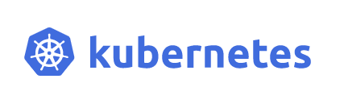
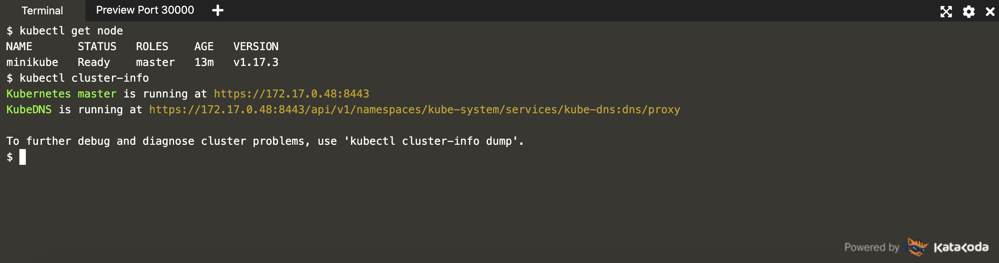

# k8s入门_初体验

### 通过k8s官网提供的小程序先来了解下k8s

地址： https://kubernetes.io/docs/tutorials

～打开终端：

～执行 run minikube start,开启了k8s集群

～查看k8s集群节点(集群为单节点，master既是主节点又是从节点)

～查看kube-system安装之后存在的pod

### 在模拟端上安装应用(安装nginx)

～部署应用

～开通访问端口,并测试访问

～修改副本数量，可发现副本数量被修改成3个副本

～滚动更新，可以看到在更新的过程中，新版本生成一个副本，旧版本就会删除一个副本

