# k8s集群安装完整过程（排坑指南）
**安装k8s还是有很多坑的，主要还是在于很多镜像下载的问题**
### 安装基础条件
操作系统：centos 
一台master（centos01） 
两台node（centos02） 

### 开启路由转发功能
> 在 /etc/sysctl.conf 文件中加入net.ipv4.ip_forward=1
>

> 执行 sysctl -p 使其生效 
> 

>查看：sysctl -a |grep -w net.ipv4.ip_forward，结果输出net.ipv4.ip_forward=1即为开启
>
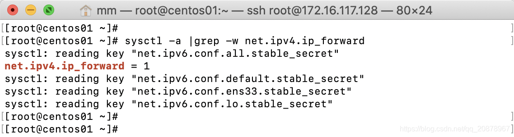

### 安装docker
～下载repo源
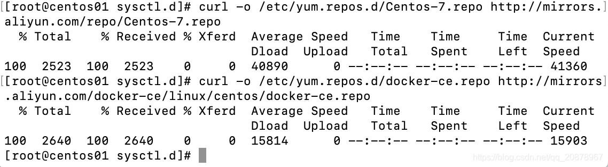

～缓存安装信息，并安装docker
> yum clean all & yum makecache 
> yum install -y docker-ce
>
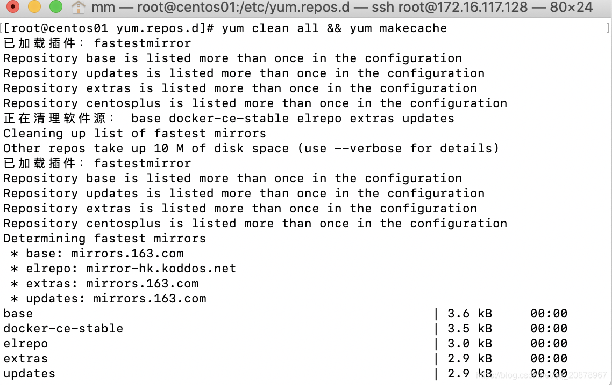
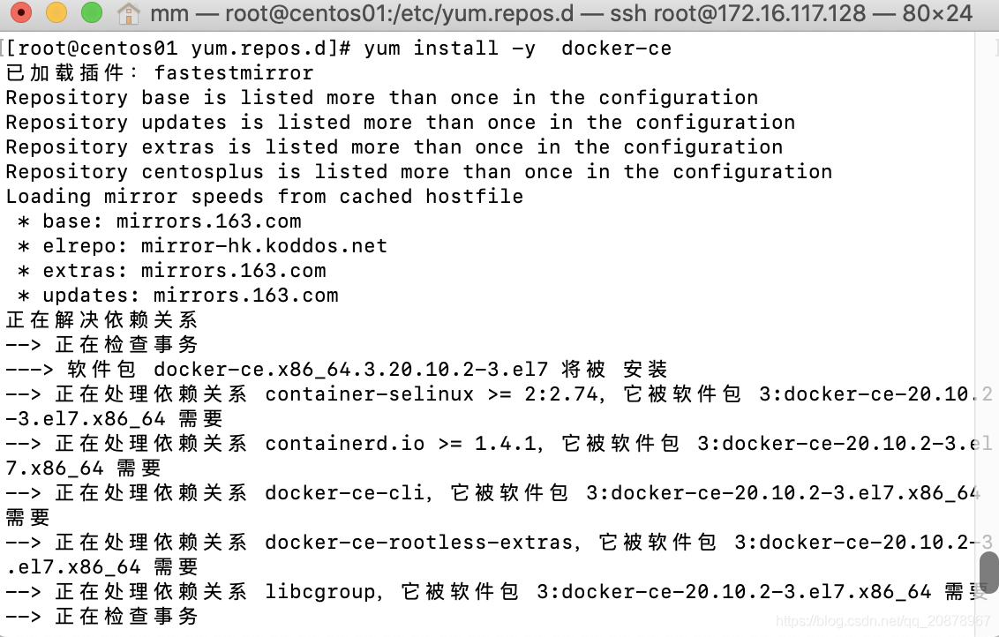

～配置docker加速
> 修改 /etc/docker/daemon.json

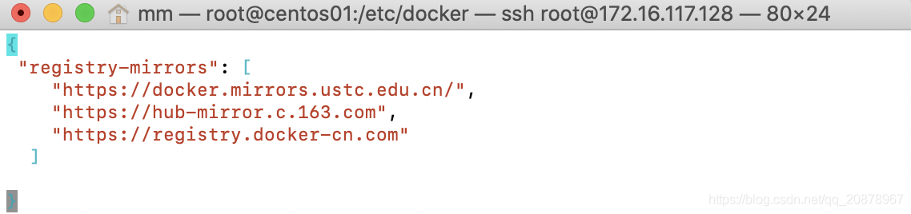

～启动docker
> sysctl start docker
>

### 安装k8s集群

～检查是否开启路由转发、关闭sellinux、swap及防火墙。三台主从服务器都需操作。
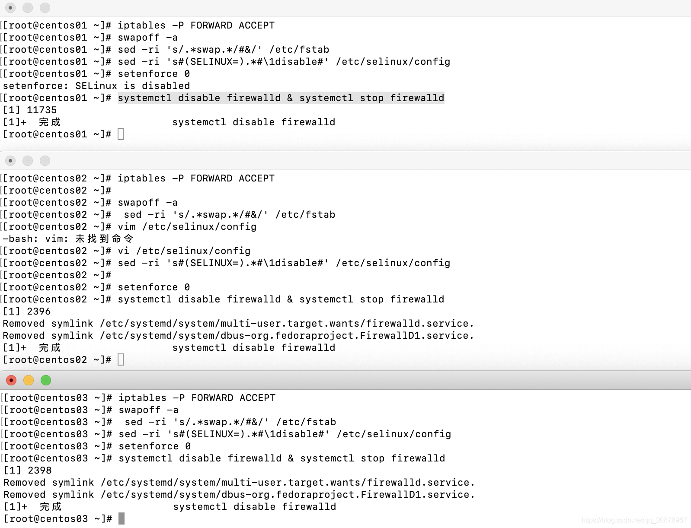

～在/etc/yum.repos.d/kubernetes.repo中编辑下载kubernetes下载源,并且安装kubelet、kebectl、kubeadm
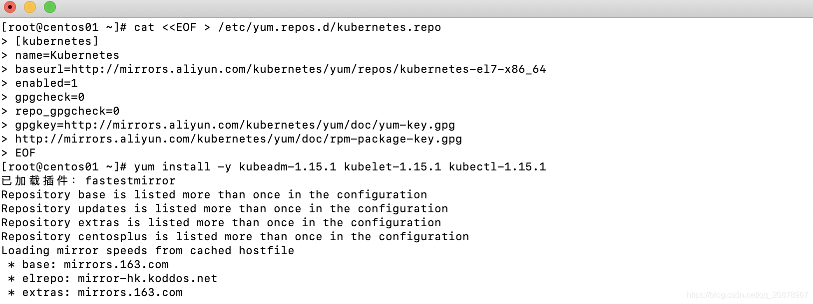

～安装k8s依赖镜像（本地下载镜像后导入），由于下载镜像都是海外网站，所以采用本地导入。三台主从服务器都需操作。 
脚本：见sh/image-load.sh 
镜像：见images/kubeadm-basic.images 
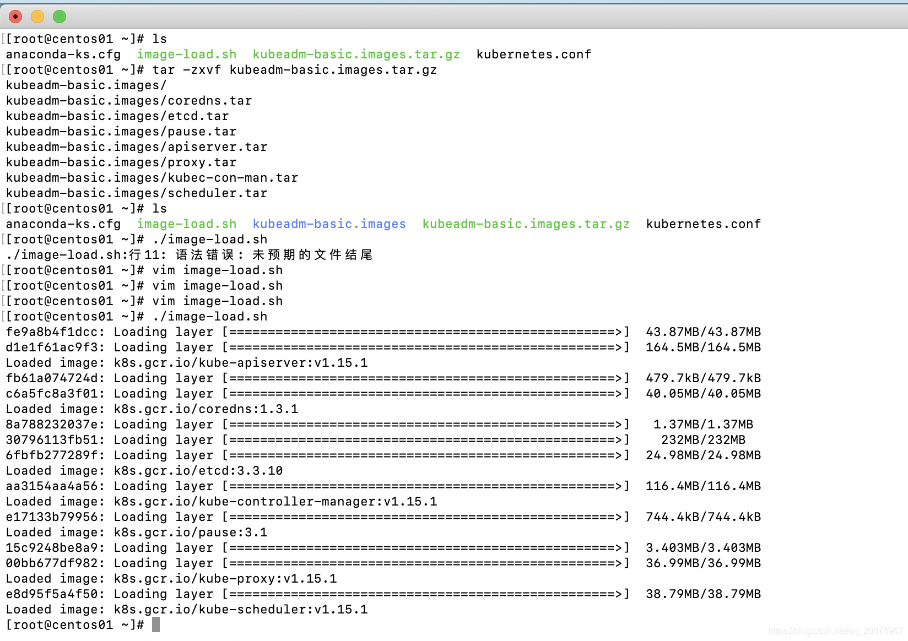

～初始化主节点，只在master节点上执行
>命令： kubeadm init --config=kubeadm-config.yaml --experimental-upload-certs | tee
>
在执行命令前需要修改kubeadm-config.yaml，修改advertiesAddress为本机ip

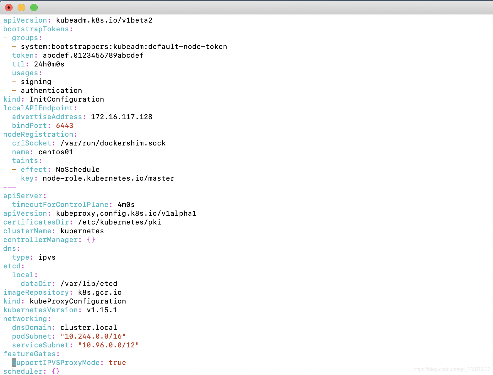
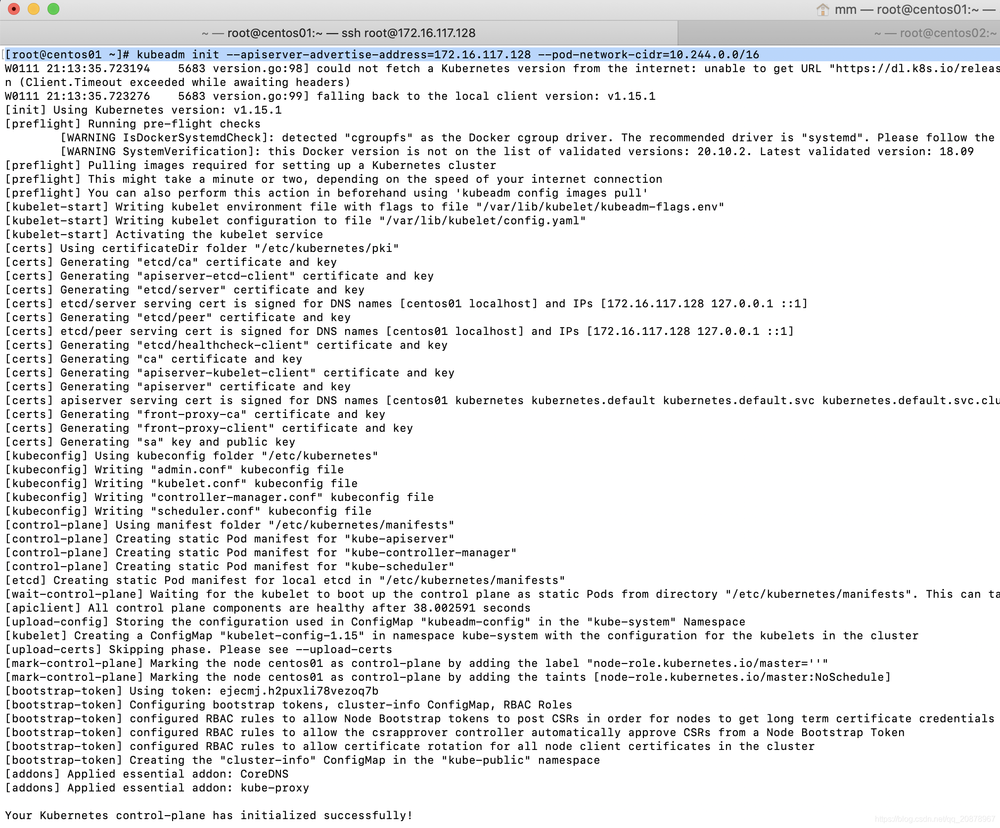

～注意事项：
> 注意安装成功后，最下面的提示信息：

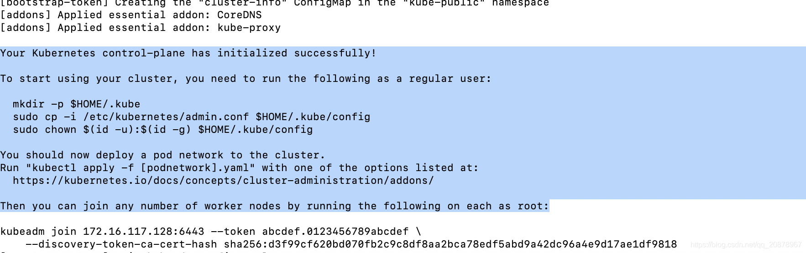
根据上面的提示信息执行：
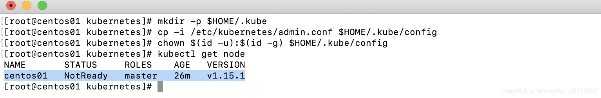
至此，我们发现已经可以成功查询node节点信息了，但是节点的状态却是NotReady,不是Runing的状态。原 因是此时我们使用ipvs+flannel的方式进行网络通信，但是flannel网络插件还没有部署，因此节点状态 此时为NotReady。

～安装flannel插件,由于网络原因可能会下载失败，那只能使用docker pull（其余两台node也需要安装）
> 执行：kubectl apply -f https://raw.githubusercontent.com/coreos/flannel/bc79dd1505b0c8681ece4de4c0d86c5cd2643275/Documentation/kube-flannel.yml

～再次查看节点状态，都是running就可以了
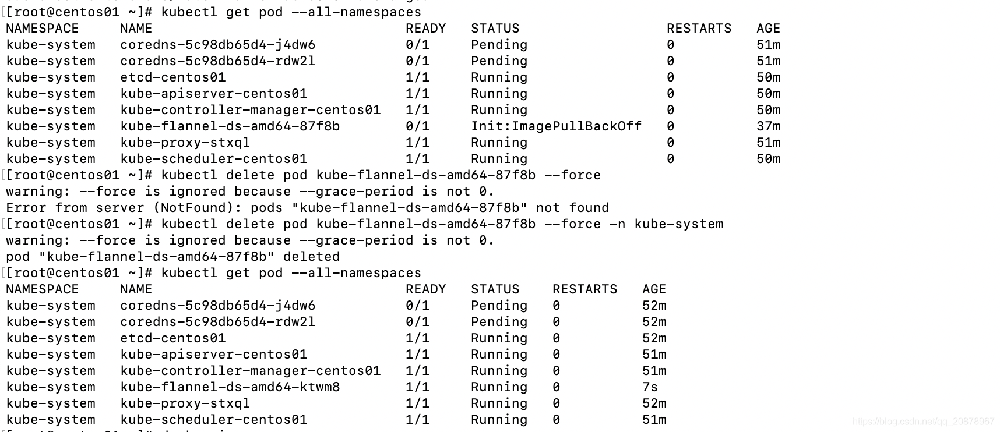

～将work节点加入master
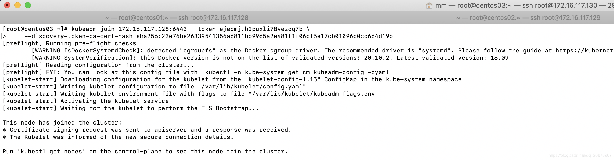
最终：
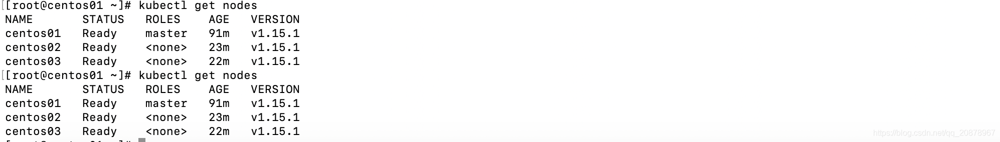

